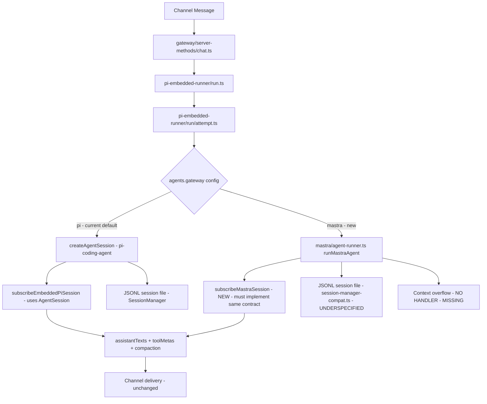

# Audit: Mastra Gateway Integration Plan — Quality Control Report

**Audited plan:** [`plans/mastra-gateway-integration.md`](plans/mastra-gateway-integration.md)  
**Audit date:** 2026-02-27  
**Auditor:** Architect mode — comprehensive code review against live codebase  
**Verdict:** ⚠️ **BLOCKED — 7 critical issues, 6 significant gaps, 4 minor issues**

---

## Executive Summary

The plan is architecturally sound at a high level (feature-flagged adapter, JSONL format preserved, same event contract), but contains **7 critical correctness issues** that would prevent a working gateway. The most severe: the plan claims `subscribeEmbeddedPiSession` can be reused unchanged, but it requires an `AgentSession` from `@mariozechner/pi-coding-agent` — a concrete pi-stack object with `.prompt()`, `.steer()`, `.abort()`, `.isStreaming`, `.isCompacting`, `.messages`, `.agent.replaceMessages()`, `.sessionId`, and `.dispose()`. The Mastra path must either implement a full compatible shim or restructure the wiring entirely.

---

## 1. Critical Issues (Blockers)

### 1.1 `subscribeEmbeddedPiSession` requires `AgentSession` — not a simple event stream

**Severity:** 🔴 Critical  
**Plan claim:** Section 8 states "The Mastra path emits the same events as the pi path so `subscribeEmbeddedPiSession` and all its callers are **unchanged**."

**Reality:** [`src/agents/pi-embedded-subscribe.types.ts:11`](src/agents/pi-embedded-subscribe.types.ts:11) shows:

```typescript
export type SubscribeEmbeddedPiSessionParams = {
  session: AgentSession;  // ← from @mariozechner/pi-coding-agent
  ...
};
```

`AgentSession` is a concrete pi-stack object. The entire `subscribeEmbeddedPiSession` function in [`src/agents/pi-embedded-subscribe.ts`](src/agents/pi-embedded-subscribe.ts) is built around it — it calls `session.prompt()`, `session.steer()`, `session.abort()`, reads `session.isStreaming`, `session.isCompacting`, `session.messages`, `session.agent.replaceMessages()`, `session.sessionId`, and `session.dispose()`.

The plan's `stream-subscriber.ts` is described as translating Mastra stream chunks into `AgentEvent` objects, but `subscribeEmbeddedPiSession` does not consume `AgentEvent` objects — it subscribes to an `AgentSession` and drives the entire prompt/compaction/abort lifecycle.

**Fix required:** The Mastra path cannot reuse `subscribeEmbeddedPiSession`. It needs either:
- A full `AgentSession`-compatible shim wrapping the Mastra `Agent` (complex, fragile), OR
- A parallel `subscribeMastraSession` function that implements the same output contract (assistantTexts, toolMetas, compaction handling, abort, etc.) without using `AgentSession`

This is the largest gap in the plan and affects the entire downstream delivery pipeline.

---

### 1.2 `EmbeddedRunAttemptResult.lastAssistant` is typed as `AssistantMessage` from `@mariozechner/pi-ai`

**Severity:** 🔴 Critical  
**Location:** [`src/agents/pi-embedded-runner/run/types.ts:37`](src/agents/pi-embedded-runner/run/types.ts:37)

```typescript
lastAssistant: AssistantMessage | undefined;  // from @mariozechner/pi-ai
```

The Mastra path must populate this field. The plan does not address how to construct an `AssistantMessage` (a pi-ai type) from Mastra's output. This field is used by callers of `runEmbeddedAttempt` for error classification and retry logic.

**Fix required:** Either define a compatible `AssistantMessage` shape from Mastra's output, or change the return type to a union/abstraction. The plan must explicitly address this.

---

### 1.3 `EmbeddedRunAttemptParams.model` is typed as `Model<Api>` from `@mariozechner/pi-ai`

**Severity:** 🔴 Critical  
**Location:** [`src/agents/pi-embedded-runner/run/types.ts:19`](src/agents/pi-embedded-runner/run/types.ts:19)

```typescript
model: Model<Api>;  // from @mariozechner/pi-ai
```

The plan's `if (usesMastra)` branch in `attempt.ts` receives `params.model` as a `Model<Api>`. The plan's `toMastraModelConfig()` takes `ModelApi`, `baseUrl`, `apiKey`, etc. — but these must be extracted from `Model<Api>`. The plan does not show how to extract `model.api`, `model.baseUrl`, `model.apiKey` from the pi-ai `Model<Api>` type.

**Fix required:** The plan must show the extraction logic from `Model<Api>` to the Mastra config params. This is non-trivial because `Model<Api>` is a pi-ai internal type.

---

### 1.4 `compaction.ts` uses `session.agent.replaceMessages()` and `session.prompt()` — not just `generateSummary`

**Severity:** 🔴 Critical  
**Plan claim:** Section 4.7 says the compaction adapter replaces `generateSummary` / `estimateTokens`.

**Reality:** [`src/agents/pi-embedded-runner/compact.ts:572-619`](src/agents/pi-embedded-runner/compact.ts:572) shows the compaction path:
1. Calls `createAgentSession()` to get a full `AgentSession`
2. Calls `session.agent.replaceMessages(limited)` to set history
3. Calls `session.prompt(compactionPrompt)` to run the compaction LLM call
4. Reads `session.messages` for the result
5. Calls `session.dispose()`

The plan's `mastraGenerateSummary` using `agent.generate()` is correct in spirit, but the plan does not address the full compaction loop: the `compact.ts` file is ~700 lines and does much more than call `generateSummary`. It handles session locking, history sanitization, transcript repair, extension factories, hook runners, and JSONL writes. The plan's "Add Mastra branch for compaction" in the modified files table is severely underspecified.

**Fix required:** The plan must specify the full compaction path for Mastra, not just the `generateSummary` replacement.

---

### 1.5 `extensions.ts` uses `SessionManager` and `ExtensionFactory` — no Mastra equivalent

**Severity:** 🔴 Critical  
**Location:** [`src/agents/pi-embedded-runner/extensions.ts`](src/agents/pi-embedded-runner/extensions.ts)

The `buildEmbeddedExtensionFactories()` function takes a `SessionManager` and returns `ExtensionFactory[]` (both pi-coding-agent types). These factories implement:
- **Compaction safeguard** — prevents runaway compaction loops
- **Context pruning** — cache-TTL based context window management

The plan does not address how these extensions work in the Mastra path. If they are silently dropped, users with `contextPruning.mode = "cache-ttl"` or `compaction.mode = "safeguard"` will get broken behavior with no warning.

**Fix required:** The plan must explicitly state whether extensions are supported in the Mastra path, and if not, document the behavioral difference and add a config validation error.

---

### 1.6 `Anthropic` is NOT OpenAI-compatible for tool calling

**Severity:** 🔴 Critical  
**Plan claim:** Section 5 states `anthropic-messages` uses `OpenAICompatibleConfig` with Anthropic base URL, claiming "Anthropic API is OpenAI-compatible for basic calls."

**Reality:** Anthropic's API uses a completely different request/response format from OpenAI:
- Anthropic uses `content` arrays with typed blocks (`text`, `tool_use`, `tool_result`)
- OpenAI uses `content` strings and `tool_calls` arrays
- Anthropic uses `x-api-key` header, not `Authorization: Bearer`
- Anthropic uses `anthropic-version` header
- Tool call format is entirely different

`OpenAICompatibleConfig` in Mastra uses `createOpenAICompatible` which sends OpenAI-format requests. Sending OpenAI-format requests to `api.anthropic.com/v1` will fail with 400 errors.

Section 15.1 partially addresses the auth header issue (Bearer token for OAuth), but does not address the fundamental API format incompatibility. The plan needs `@ai-sdk/anthropic` for direct Anthropic calls, not `OpenAICompatibleConfig`.

**Fix required:** Add `@ai-sdk/anthropic` to the dependency list and use it for `anthropic-messages` API. The plan's provider support matrix is incorrect for Anthropic.

---

### 1.7 `maxSteps` default of 50 may break the compaction safeguard

**Severity:** 🔴 Critical  
**Plan claim:** Section 15.3 recommends `maxSteps: 50` as the default.

**Reality:** The pi-coding-agent loop runs until the model stops calling tools. The compaction safeguard extension (in `extensions.ts`) monitors the session and triggers compaction when the context window fills. With Mastra's `maxSteps: 50`, a long-running agent that needs compaction mid-run will be cut off at step 50 — the compaction extension won't fire because it's a pi-stack extension that doesn't exist in the Mastra path.

More critically: the plan does not address what happens when the context window fills during a Mastra run. The pi path handles this via the compaction safeguard extension. The Mastra path has no equivalent.

**Fix required:** The plan must specify how context overflow is handled in the Mastra path. Options: (a) implement a Mastra-native compaction hook, (b) document that `gateway = "mastra"` does not support compaction (and add a config validation error), or (c) implement a wrapper that monitors token usage and triggers compaction.

---

## 2. Significant Gaps

### 2.1 `session-manager-compat.ts` is underspecified

**Plan claim:** Section 4.6 says this module "wraps the existing JSONL read/write logic" to provide the same interface to the Mastra runner.

**Reality:** The JSONL read/write logic is deeply embedded in `SessionManager` from pi-coding-agent. It handles:
- Branching (tree-structured session history)
- Leaf tracking
- Atomic file writes
- Session header entries
- Tool result pairing

The plan does not specify what interface `session-manager-compat.ts` exposes or how it reads/writes JSONL without `SessionManager`. This is a significant implementation gap.

---

### 2.2 `wrapStreamFnTrimToolCallNames` has no Mastra equivalent

**Location:** [`src/agents/pi-embedded-runner/run/attempt.ts:192`](src/agents/pi-embedded-runner/run/attempt.ts:192)

The pi path wraps `streamFn` to trim whitespace from tool call names before dispatch. This is a known provider quirk fix. The Mastra path must implement equivalent normalization in `stream-subscriber.ts` or `agent-runner.ts`.

---

### 2.3 `applyExtraParamsToAgent` has no Mastra equivalent

**Location:** [`src/agents/pi-embedded-runner/extra-params.ts`](src/agents/pi-embedded-runner/extra-params.ts)

This function applies provider-specific stream params (temperature, cache retention, OpenRouter headers, Anthropic 1M context beta, etc.) to the pi agent. The Mastra path must pass these through `providerOptions` or `headers` in `AgentStreamOptions`. The plan mentions `toMastraStreamOptions` for thinking levels but does not address the full `applyExtraParamsToAgent` surface.

---

### 2.4 `dropThinkingBlocks` and `sanitizeToolCallIds` stream wrappers

**Location:** [`src/agents/pi-embedded-runner/run/attempt.ts:798-842`](src/agents/pi-embedded-runner/run/attempt.ts:798)

The pi path wraps `streamFn` to:
1. Drop thinking blocks from outbound messages (for Copilot/Claude follow-up calls)
2. Sanitize tool call IDs for Mistral/CloudCodeAssist format requirements

These are critical correctness fixes for specific providers. The Mastra path must implement equivalent pre-processing in `agent-runner.ts` before passing messages to `agent.stream()`.

---

### 2.5 `cacheTrace` and `anthropicPayloadLogger` wrappers

**Location:** [`src/agents/pi-embedded-runner/run/attempt.ts:738-853`](src/agents/pi-embedded-runner/run/attempt.ts:738)

These diagnostic/observability wrappers are applied to `streamFn` in the pi path. The plan does not address how these are applied in the Mastra path. Silently dropping them means cache tracing and Anthropic payload logging stop working when `gateway = "mastra"`.

---

### 2.6 `zod@^4.3.6` vs Mastra's Zod dependency

**Location:** [`package.json:208`](package.json:208)

The project uses `zod@^4.3.6`. Mastra v1.8.0 was built against Zod v3. The `createTool` API uses Zod v3 schemas. There may be a version conflict. The plan does not address this. The `typebox-to-zod.ts` converter must produce Zod v3 schemas if Mastra expects them, but the project's `zod` import resolves to v4.

**Fix required:** Verify Mastra v1.8.0's Zod peer dependency and whether it bundles its own Zod or uses the project's. If there's a conflict, the plan must address it.

---

## 3. Minor Issues

### 3.1 `agents.defaults.gateway` vs `agents.defaults.defaults.gateway`

**Plan claim:** Section 6.1 adds `gateway?: "pi" | "mastra"` to `AgentDefaultsConfig`.

**Reality:** [`src/config/types.agent-defaults.ts`](src/config/types.agent-defaults.ts) is `AgentDefaultsConfig`. The plan's wiring in Section 6.2 reads `params.config?.agents?.defaults?.gateway` — but `AgentDefaultsConfig` is at `agents.defaults`, so the path would be `agents.defaults.gateway`. This is correct. However, the plan also says "Add `gateway?: "pi" | "mastra"` to `src/config/types.agents.ts`" in the modified files table — but `types.agents.ts` contains `AgentConfig` and `AgentsConfig`, not `AgentDefaultsConfig`. The correct file is `src/config/types.agent-defaults.ts`.

---

### 3.2 `AgentDefaultsSchema` uses `.strict()` — new field must be added before the closing `.strict()`

**Location:** [`src/config/zod-schema.agent-defaults.ts:167`](src/config/zod-schema.agent-defaults.ts:167)

The schema ends with `.strict().optional()`. Adding `gateway` must be inside the `.object({...})` block, not after. The plan does not show the exact diff, but this is a common mistake.

---

### 3.3 `@mastra/core@1.8.0` exact version + `pnpm.patchedDependencies` note is premature

**Plan claim:** Section 10.1 says `@mastra/core` must use exact version `1.8.0` since it will be in `pnpm.patchedDependencies` if patches are needed.

**Reality:** Per AGENTS.md: "Any dependency with `pnpm.patchedDependencies` must use an exact version." But `@mastra/core` is not yet patched. The exact version pin is correct as a precaution, but the plan should not imply it's already in `pnpm.patchedDependencies`. The note is misleading.

---

### 3.4 `@ai-sdk/google` and `@ai-sdk/amazon-bedrock` may conflict with existing `google-auth-library` and `@aws-sdk/client-bedrock`

**Location:** [`package.json:153`](package.json:153), [`package.json:184`](package.json:184)

The project already uses `google-auth-library@10.5.0` and `@aws-sdk/client-bedrock@^3.998.0` for Bedrock discovery. Adding `@ai-sdk/google` and `@ai-sdk/amazon-bedrock` introduces parallel auth stacks. The plan should verify there are no conflicts and that the existing Bedrock discovery path is unaffected.

---

## 4. What the Plan Gets Right

- ✅ Feature-flag approach (`gateway = "pi" | "mastra"`) is correct — safe rollout
- ✅ JSONL session format preservation is the right constraint
- ✅ TypeBox → Zod conversion is correctly identified as needed
- ✅ `maxSteps` must be set explicitly (Section 15.3 is correct)
- ✅ `OpenAICompatibleConfig` for Ollama, OpenRouter, GitHub Copilot is correct
- ✅ `@ai-sdk/google` for Google native auth is correct
- ✅ `@ai-sdk/amazon-bedrock` for Bedrock SigV4 is correct
- ✅ Anthropic OAuth token (`sk-ant-oat-*`) via Bearer header analysis (Section 15.1) is correct for OAuth tokens specifically
- ✅ `providerOptions` for thinking/reasoning is the right Mastra API
- ✅ Implementation sequence (22 steps) is well-ordered
- ✅ Risk assessment table is thorough

---

## 5. Required Plan Revisions Before Implementation

### Priority 1 — Must fix before any code is written

1. **Redesign the `subscribeEmbeddedPiSession` integration.** Either:
   - Write a `subscribeMastraSession()` function that implements the same output contract (assistantTexts, toolMetas, compaction, abort, usage, messaging tool tracking), OR
   - Write a full `AgentSession`-compatible shim around Mastra's `Agent`
   
2. **Add `@ai-sdk/anthropic` to dependencies** and use it for `anthropic-messages` API. Remove the claim that `OpenAICompatibleConfig` works for Anthropic.

3. **Specify the full compaction path for Mastra.** The plan's "Add Mastra branch for compaction" is not sufficient — `compact.ts` is ~700 lines and the Mastra branch needs to handle the full lifecycle.

4. **Address context overflow / compaction safeguard.** Specify what happens when the context window fills during a Mastra run.

5. **Address `Model<Api>` extraction.** Show how `model.api`, `model.baseUrl`, `model.apiKey` are extracted from the pi-ai `Model<Api>` type for the Mastra config.

6. **Address `EmbeddedRunAttemptResult.lastAssistant` typing.** Show how to construct an `AssistantMessage` from Mastra output, or propose a type change.

### Priority 2 — Must fix before PR is merged

7. **Add stream pre-processing equivalents** for `dropThinkingBlocks`, `sanitizeToolCallIds`, and `wrapStreamFnTrimToolCallNames` in the Mastra path.

8. **Address `applyExtraParamsToAgent` surface** — map provider-specific params (cache retention, OpenRouter headers, Anthropic 1M beta, temperature) to Mastra's `AgentStreamOptions`.

9. **Verify Zod version compatibility** between `zod@^4.3.6` (project) and Mastra v1.8.0's Zod peer dependency.

10. **Fix the modified files table** — `types.agents.ts` should be `types.agent-defaults.ts`.

11. **Address extensions** — explicitly state whether compaction safeguard and context pruning extensions are supported in the Mastra path.

### Priority 3 — Should address before GA

12. **Address `cacheTrace` and `anthropicPayloadLogger`** — specify how these are applied in the Mastra path.

13. **Verify `@ai-sdk/google` / `@ai-sdk/amazon-bedrock` don't conflict** with existing `google-auth-library` and `@aws-sdk/client-bedrock`.

---

## 6. Architecture Diagram — Corrected

The plan's diagram (Section 14) is misleading because it shows `subscribeEmbeddedPiSession` as unchanged. The corrected flow:



---

## 7. Verdict

The plan is **not ready for implementation** in its current form. The 7 critical issues would result in:
- Runtime crashes when `gateway = "mastra"` is set (wrong API format for Anthropic)
- TypeScript compilation errors (`AssistantMessage` type mismatch)
- Silent behavioral regressions (no compaction, no context pruning, no cache tracing)
- Incomplete gateway (no abort, no steer, no compaction retry)

The plan needs a revision pass addressing at minimum Priority 1 items before any code is written.
