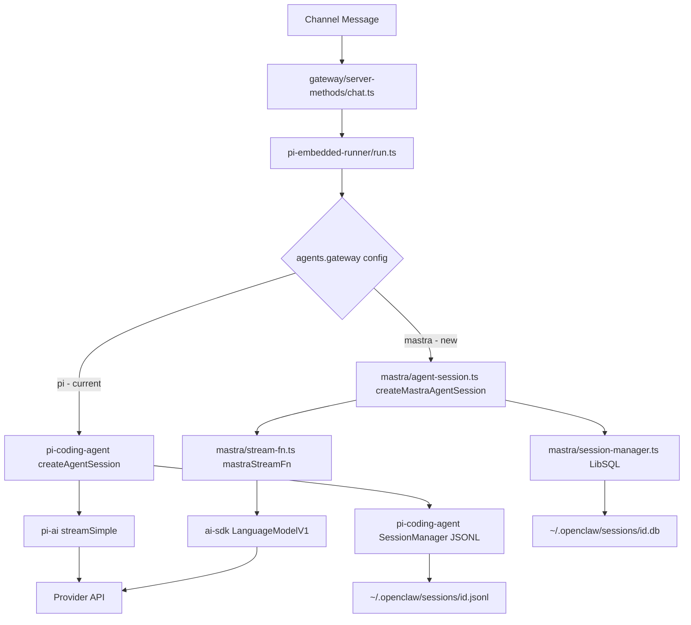

# Plan: Replace pi-coding-agent LLM Gateway with Mastra

**Status:** Draft — awaiting review  
**Branch target:** `main`  
**Scope:** Core LLM/AI gateway swap — messaging channels, CLI, config schema, and UI are out of scope unless directly impacted.

---

## 1. Executive Summary

OpenClaw currently uses the `@mariozechner/pi-coding-agent` / `@mariozechner/pi-ai` / `@mariozechner/pi-agent-core` stack as its embedded LLM execution engine. This plan describes how to replace that stack with [Mastra](https://mastra.ai) — an open-source TypeScript AI framework — as the new LLM gateway, while preserving all existing channel integrations, session management, tool execution, and streaming behaviour.

The swap is **additive-then-replace**: a Mastra adapter layer is introduced alongside the existing pi stack, feature-parity is validated, then the pi stack is removed.

---

## 2. Current Architecture

### 2.1 The pi-coding-agent Stack

The current LLM execution path is:

```
Channel message
  → src/gateway/server-methods/chat.ts
    → src/agents/pi-embedded-runner/run.ts  (runEmbeddedPiAgent)
      → src/agents/pi-embedded-runner/run/attempt.ts  (runEmbeddedAttempt)
        → @mariozechner/pi-coding-agent  createAgentSession()
          → @mariozechner/pi-ai  streamSimple()  (or createOllamaStreamFn)
            → Provider API (Anthropic / OpenAI / Google / Bedrock / Ollama / etc.)
```

Key packages and their roles:

| Package | Role |
|---|---|
| [`@mariozechner/pi-agent-core`](package.json:163) | Core types: `AgentMessage`, `AgentTool`, `AgentToolResult`, `StreamFn`, `ThinkingLevel` |
| [`@mariozechner/pi-ai`](package.json:164) | Provider clients: `streamSimple`, `completeSimple`, `getModel`, `Model`, `Api`, `AssistantMessage`, OAuth helpers |
| [`@mariozechner/pi-coding-agent`](package.json:165) | Session management: `SessionManager`, `createAgentSession`, `DefaultResourceLoader`, `SettingsManager`, `codingTools`, `generateSummary`, `estimateTokens` |

### 2.2 Integration Surface (files that import pi packages)

The following source files directly import from the pi stack and will need to be adapted:

**Core execution path:**
- [`src/agents/pi-embedded-runner/run/attempt.ts`](src/agents/pi-embedded-runner/run/attempt.ts:1) — main agent loop, `createAgentSession`, `SessionManager`, `streamSimple`
- [`src/agents/pi-embedded-runner/compact.ts`](src/agents/pi-embedded-runner/compact.ts:1) — compaction loop, same imports
- [`src/agents/pi-embedded-runner/model.ts`](src/agents/pi-embedded-runner/model.ts:1) — model resolution, `AuthStorage`, `ModelRegistry`
- [`src/agents/pi-embedded-runner/extra-params.ts`](src/agents/pi-embedded-runner/extra-params.ts:1) — `StreamFn` wrapping, `streamSimple`
- [`src/agents/pi-embedded-runner/extensions.ts`](src/agents/pi-embedded-runner/extensions.ts:1) — `ExtensionFactory`, `SessionManager`
- [`src/agents/pi-embedded-runner/google.ts`](src/agents/pi-embedded-runner/google.ts:1) — Google-specific session sanitization, `SessionManager`
- [`src/agents/pi-embedded-runner/tool-result-truncation.ts`](src/agents/pi-embedded-runner/tool-result-truncation.ts:1) — `SessionManager`
- [`src/agents/pi-embedded-runner/system-prompt.ts`](src/agents/pi-embedded-runner/system-prompt.ts:1) — `AgentSession`
- [`src/agents/pi-model-discovery.ts`](src/agents/pi-model-discovery.ts:1) — `AuthStorage`, `ModelRegistry` from pi-coding-agent
- [`src/agents/model-auth.ts`](src/agents/model-auth.ts:1) — `getEnvApiKey`, `Model`, `Api` from pi-ai
- [`src/agents/model-compat.ts`](src/agents/model-compat.ts:1) — `Model`, `Api` from pi-ai
- [`src/agents/model-forward-compat.ts`](src/agents/model-forward-compat.ts:1) — `Model`, `Api`, `ModelRegistry`
- [`src/agents/compaction.ts`](src/agents/compaction.ts:1) — `generateSummary`, `estimateTokens`, `ExtensionContext`
- [`src/agents/pi-tools.ts`](src/agents/pi-tools.ts:1) — `codingTools`, `createReadTool`, `readTool`
- [`src/agents/pi-tools.read.ts`](src/agents/pi-tools.read.ts:1) — `createEditTool`, `createReadTool`, `createWriteTool`
- [`src/agents/pi-project-settings.ts`](src/agents/pi-project-settings.ts:1) — `SettingsManager`
- [`src/agents/session-tool-result-guard.ts`](src/agents/session-tool-result-guard.ts:1) — `SessionManager`
- [`src/agents/session-tool-result-guard-wrapper.ts`](src/agents/session-tool-result-guard-wrapper.ts:1) — `SessionManager`
- [`src/agents/pi-embedded-subscribe.ts`](src/agents/pi-embedded-subscribe.ts:1) — `AgentMessage`
- [`src/agents/ollama-stream.ts`](src/agents/ollama-stream.ts:1) — `StreamFn`, `createAssistantMessageEventStream`
- [`src/agents/anthropic-payload-log.ts`](src/agents/anthropic-payload-log.ts:1) — `AgentMessage`, `StreamFn`, `Model`, `Api`
- [`src/agents/skills/workspace.ts`](src/agents/skills/workspace.ts:1) — `loadSkillsFromDir`, `Skill`
- [`src/agents/skills/bundled-context.ts`](src/agents/skills/bundled-context.ts:1) — `loadSkillsFromDir`
- [`src/agents/pi-extensions/compaction-safeguard.ts`](src/agents/pi-extensions/compaction-safeguard.ts:1) — `ExtensionAPI`, `FileOperations`
- [`src/agents/pi-extensions/context-pruning/extension.ts`](src/agents/pi-extensions/context-pruning/extension.ts:1) — `ExtensionAPI`, `ExtensionContext`

**Auth / credential path:**
- [`src/agents/auth-profiles/oauth.ts`](src/agents/auth-profiles/oauth.ts:1) — `OAuthCredentials`, `OAuthProvider`
- [`src/agents/auth-profiles/store.ts`](src/agents/auth-profiles/store.ts:1) — `OAuthCredentials`
- [`src/agents/auth-profiles/types.ts`](src/agents/auth-profiles/types.ts:1) — `OAuthCredentials`
- [`src/agents/cli-credentials.ts`](src/agents/cli-credentials.ts:1) — `OAuthCredentials`, `OAuthProvider`
- [`src/agents/chutes-oauth.ts`](src/agents/chutes-oauth.ts:1) — `OAuthCredentials`

---

## 3. Mastra Overview

[Mastra](https://mastra.ai) is a TypeScript-first AI framework that provides:

- **`@mastra/core`** — Agent, LLM, Tool, Memory, Workflow primitives
- **`@mastra/core/llm`** — Unified `LLM` class wrapping [Vercel AI SDK](https://sdk.vercel.ai) providers
- **`@mastra/memory`** — Conversation memory / session persistence (LibSQL/Postgres/Upstash)
- **`@mastra/tools`** — Pre-built tool integrations
- Provider packages: `@ai-sdk/anthropic`, `@ai-sdk/openai`, `@ai-sdk/google`, `@ai-sdk/amazon-bedrock`, `ollama-ai-provider`, etc.

### 3.1 Mastra Agent API (simplified)

```typescript
import { Agent } from "@mastra/core/agent";
import { anthropic } from "@ai-sdk/anthropic";

const agent = new Agent({
  name: "openclaw-agent",
  model: anthropic("claude-opus-4-5"),
  instructions: systemPrompt,
  tools: { readFile, writeFile, execBash },
});

// Streaming
const stream = await agent.stream(messages, { maxSteps: 50 });
for await (const chunk of stream.textStream) { ... }

// Tool calls come through stream.fullStream
for await (const event of stream.fullStream) {
  if (event.type === "tool-call") { ... }
  if (event.type === "tool-result") { ... }
  if (event.type === "text-delta") { ... }
}
```

### 3.2 Mastra Memory API

```typescript
import { Memory } from "@mastra/memory";
import { LibSQLStore } from "@mastra/memory/storage/libsql";

const memory = new Memory({
  storage: new LibSQLStore({ url: "file:sessions.db" }),
});

// Load thread
const { messages } = await memory.getMessages({ threadId: sessionKey });

// Append
await memory.saveMessages({ threadId: sessionKey, messages: newMessages });
```

---

## 4. Architecture of the Mastra Adapter Layer

The strategy is to introduce a **thin adapter layer** (`src/agents/mastra/`) that implements the same internal contracts currently fulfilled by the pi stack, without changing any of the channel, routing, or CLI code.

### 4.1 Adapter Layer Structure

```
src/agents/mastra/
  index.ts                  — public re-exports
  agent-session.ts          — replaces createAgentSession() from pi-coding-agent
  stream-fn.ts              — replaces streamSimple() from pi-ai
  session-manager.ts        — replaces SessionManager from pi-coding-agent
  model-registry.ts         — replaces ModelRegistry / AuthStorage from pi-coding-agent
  tool-adapter.ts           — bridges AgentTool (pi-agent-core) → Mastra Tool format
  message-adapter.ts        — bridges AgentMessage (pi-agent-core) ↔ Mastra CoreMessage
  compaction.ts             — replaces generateSummary / estimateTokens
  ollama-stream.ts          — replaces src/agents/ollama-stream.ts
  types.ts                  — shared internal types
```

### 4.2 Type Compatibility Map

| pi-agent-core / pi-ai type | Mastra equivalent | Notes |
|---|---|---|
| `AgentMessage` | `CoreMessage` (ai-sdk) | Role mapping: user/assistant/tool |
| `AgentTool` | `Tool` (mastra) | Schema via TypeBox → Zod conversion |
| `AgentToolResult` | `ToolResultPart` | Wrapped in `CoreToolMessage` |
| `StreamFn` | `agent.stream()` | Returns `MastraAgentStream` |
| `SessionManager` | `Memory` (mastra) | LibSQL-backed, file-path keyed |
| `ModelRegistry` | Provider map + `@ai-sdk/*` | Keyed by `provider:modelId` |
| `AuthStorage` | OpenClaw `auth-profiles` store | Already managed by OpenClaw |
| `Model<Api>` | `LanguageModelV1` (ai-sdk) | Resolved from provider config |
| `ThinkingLevel` | `providerOptions.thinking` | Anthropic/Google specific |
| `ExtensionFactory` | Mastra middleware / hooks | Compaction, context pruning |

### 4.3 Session Manager Adapter

The current `SessionManager` from pi-coding-agent:
- Reads/writes a JSONL session file at a given path
- Provides `appendMessage()`, `getBranch()`, `getMessages()`, `appendCustomEntry()`
- Has an `inMemory()` factory for tests

The Mastra `Memory` class uses a database (LibSQL by default). To preserve the existing file-based session format (which is user-visible and used by the CLI), the adapter will:

1. Use `@mastra/memory` with a **LibSQL file-per-session** strategy, mapping `sessionFile` path → SQLite DB path (e.g. `sessions/<id>.db`)
2. Expose the same `SessionManager`-compatible interface so existing call sites need minimal changes
3. Provide a migration utility to convert existing JSONL session files to the new format

### 4.4 Stream Function Adapter

The current `streamSimple` from pi-ai is a function with signature:
```typescript
type StreamFn = (model: Model<Api>, context: Context, options?: SimpleStreamOptions) => Stream
```

The Mastra adapter will expose a compatible `StreamFn` that:
1. Resolves the Mastra `Agent` instance for the given `provider:modelId`
2. Calls `agent.stream(messages, { toolChoice, maxSteps })` 
3. Wraps the Mastra stream in the same event shape that `subscribeEmbeddedPiSession` expects

### 4.5 Model Registry Adapter

The current `ModelRegistry` from pi-coding-agent discovers models from `auth.json` and a built-in catalog. The Mastra adapter will:

1. Read from OpenClaw's existing `models.json` / `auth-profiles.json` (no format change)
2. Construct `@ai-sdk/*` provider instances dynamically based on `ModelApi` type
3. Cache provider instances per `provider:baseUrl:apiKey` tuple

Provider mapping:

| `ModelApi` value | Mastra/ai-sdk provider |
|---|---|
| `anthropic-messages` | `@ai-sdk/anthropic` with custom `baseURL` |
| `openai-completions` | `@ai-sdk/openai` |
| `openai-responses` | `@ai-sdk/openai` (Responses API) |
| `google-generative-ai` | `@ai-sdk/google` |
| `bedrock-converse-stream` | `@ai-sdk/amazon-bedrock` |
| `ollama` | `ollama-ai-provider` |
| `github-copilot` | `@ai-sdk/openai` with Copilot baseURL |
| `openai-codex-responses` | `@ai-sdk/openai` (Codex endpoint) |

### 4.6 Tool Adapter

OpenClaw tools are defined using TypeBox schemas (`@sinclair/typebox`). Mastra tools use Zod schemas. The adapter will:

1. Convert TypeBox `TSchema` → Zod schema using `typebox-to-zod` (or a lightweight custom converter)
2. Wrap the existing tool `execute` function in Mastra's `createTool()` format
3. Preserve tool result streaming and error handling

### 4.7 Compaction Adapter

The current compaction uses `generateSummary` and `estimateTokens` from pi-coding-agent. The Mastra adapter will:

1. Use `agent.generate()` (non-streaming) with a summarization prompt for `generateSummary`
2. Use the ai-sdk's token counting utilities or a simple character-based estimate for `estimateTokens`

---

## 5. Migration Strategy

### Phase 1: Introduce Mastra Adapter (non-breaking)

**Goal:** Add the Mastra adapter layer without removing any pi stack code. Both paths coexist.

Steps:
1. Add Mastra dependencies to `package.json`
2. Create `src/agents/mastra/` adapter layer
3. Add a feature flag: `agents.gateway = "pi" | "mastra"` in config schema
4. Wire the flag in `src/agents/pi-embedded-runner/run/attempt.ts` to choose the execution path
5. Write unit tests for each adapter module
6. Run existing test suite — all tests must pass with `gateway = "pi"` (default)

### Phase 2: Validate Parity

**Goal:** Confirm Mastra path produces equivalent results for all supported providers.

Steps:
1. Enable `gateway = "mastra"` in CI live-test environment
2. Run `pnpm test:live` against Anthropic, OpenAI, Google, Bedrock, Ollama
3. Validate streaming, tool calling, compaction, context window management
4. Fix any parity gaps found

### Phase 3: Flip Default

**Goal:** Make Mastra the default gateway.

Steps:
1. Change default `agents.gateway` to `"mastra"`
2. Keep `"pi"` as a fallback option (deprecated)
3. Update docs and CHANGELOG

### Phase 4: Remove pi Stack (future)

**Goal:** Remove the pi stack dependencies entirely.

Steps:
1. Remove `@mariozechner/pi-*` from `package.json`
2. Delete `src/agents/pi-model-discovery.ts`, `src/agents/pi-auth-json.ts`, etc.
3. Remove `gateway = "pi"` config option
4. Update all tests

---

## 6. Detailed File-by-File Changes

### 6.1 New Files

| File | Purpose |
|---|---|
| `src/agents/mastra/index.ts` | Public exports |
| `src/agents/mastra/agent-session.ts` | `createMastraAgentSession()` — replaces `createAgentSession` |
| `src/agents/mastra/stream-fn.ts` | `mastraStreamFn` — replaces `streamSimple` |
| `src/agents/mastra/session-manager.ts` | `MastraSessionManager` — replaces `SessionManager` |
| `src/agents/mastra/model-registry.ts` | `MastraModelRegistry` — replaces `ModelRegistry` |
| `src/agents/mastra/tool-adapter.ts` | `adaptToolsForMastra()` — TypeBox → Zod |
| `src/agents/mastra/message-adapter.ts` | `toCoreMessages()`, `fromCoreMessages()` |
| `src/agents/mastra/compaction.ts` | `mastraGenerateSummary()`, `mastraEstimateTokens()` |
| `src/agents/mastra/ollama-stream.ts` | Mastra-native Ollama stream |
| `src/agents/mastra/types.ts` | Internal types |
| `src/agents/mastra/provider-factory.ts` | Builds `@ai-sdk/*` provider instances from config |
| `src/agents/mastra/session-migration.ts` | JSONL → LibSQL migration utility |
| `src/agents/mastra/*.test.ts` | Unit tests for each module |

### 6.2 Modified Files

| File | Change |
|---|---|
| [`src/agents/pi-embedded-runner/run/attempt.ts`](src/agents/pi-embedded-runner/run/attempt.ts:711) | Add `if (useMastra)` branch around `createAgentSession` / `streamSimple` calls |
| [`src/agents/pi-embedded-runner/compact.ts`](src/agents/pi-embedded-runner/compact.ts:572) | Same — add Mastra branch for compaction loop |
| [`src/agents/pi-embedded-runner/model.ts`](src/agents/pi-embedded-runner/model.ts:42) | Add `resolveMastraModel()` alongside `resolveModel()` |
| [`src/agents/pi-embedded-runner/extra-params.ts`](src/agents/pi-embedded-runner/extra-params.ts:154) | Wrap Mastra stream with same extra-params logic |
| [`src/config/types.agents.ts`](src/config/types.agents.ts:1) | Add `gateway?: "pi" \| "mastra"` to agent defaults |
| [`src/config/schema.ts`](src/config/schema.ts:1) | Add schema entry for `agents.gateway` |
| [`src/config/zod-schema.agent-defaults.ts`](src/config/zod-schema.agent-defaults.ts:1) | Add Zod validation for `gateway` field |
| `package.json` | Add `@mastra/core`, `@mastra/memory`, `@ai-sdk/anthropic`, `@ai-sdk/openai`, `@ai-sdk/google`, `@ai-sdk/amazon-bedrock`, `ollama-ai-provider` |

### 6.3 Unchanged Files (no pi imports)

All channel files (`src/telegram/`, `src/discord/`, `src/slack/`, `src/signal/`, `src/web/`, `extensions/`), routing, CLI, config loading, session key management, and the gateway HTTP/WS server are **not touched**.

---

## 7. Dependency Changes

### 7.1 New Dependencies

```json
{
  "@mastra/core": "^0.10.0",
  "@mastra/memory": "^0.10.0",
  "@ai-sdk/anthropic": "^1.2.0",
  "@ai-sdk/openai": "^1.3.0",
  "@ai-sdk/google": "^1.2.0",
  "@ai-sdk/amazon-bedrock": "^1.2.0",
  "ollama-ai-provider": "^1.2.0",
  "ai": "^4.3.0"
}
```

> **Note:** `ai` (Vercel AI SDK core) is a peer dependency of `@mastra/core`. Pin to exact versions per AGENTS.md policy for patched deps.

### 7.2 Removed Dependencies (Phase 4 only)

```json
{
  "@mariozechner/pi-agent-core": "removed",
  "@mariozechner/pi-ai": "removed",
  "@mariozechner/pi-coding-agent": "removed",
  "@mariozechner/pi-tui": "removed"
}
```

> `@mariozechner/pi-tui` is used by the TUI command — that path needs separate evaluation before removal.

---

## 8. Session Format Migration

### 8.1 Current Format

Sessions are stored as JSONL files at `~/.openclaw/agents/<agentId>/sessions/<sessionId>.jsonl`. Each line is a JSON object with a `role` field (`user`, `assistant`, `tool`).

### 8.2 New Format

Mastra Memory with LibSQL stores messages in a SQLite database. The migration utility (`src/agents/mastra/session-migration.ts`) will:

1. On first run with `gateway = "mastra"`, detect existing JSONL session files
2. Convert each JSONL file to a LibSQL database at the same path with `.db` extension
3. Keep the original JSONL file as a backup (`.jsonl.bak`)
4. Log migration results

### 8.3 Backward Compatibility

- The `gateway = "pi"` path continues to use JSONL files
- The `gateway = "mastra"` path uses LibSQL
- Sessions started on one path cannot be continued on the other without migration

---

## 9. Testing Plan

### 9.1 Unit Tests (new)

Each adapter module gets a `*.test.ts` file:

- `src/agents/mastra/message-adapter.test.ts` — round-trip conversion
- `src/agents/mastra/tool-adapter.test.ts` — TypeBox → Zod schema conversion
- `src/agents/mastra/session-manager.test.ts` — CRUD operations, in-memory mode
- `src/agents/mastra/model-registry.test.ts` — provider resolution from config
- `src/agents/mastra/compaction.test.ts` — summary generation mock

### 9.2 Integration Tests

- Extend existing `src/agents/pi-embedded-runner.test.ts` to run with `gateway = "mastra"` flag
- Add `src/agents/mastra/agent-session.integration.test.ts` with mocked provider

### 9.3 Live Tests

- Add `src/agents/mastra/mastra-gateway.live.test.ts` gated behind `OPENCLAW_LIVE_TEST=1`
- Test against Anthropic, OpenAI, Google providers

### 9.4 Coverage

Maintain existing 70% V8 coverage thresholds. New adapter code must be covered.

---

## 10. Risk Assessment

| Risk | Likelihood | Impact | Mitigation |
|---|---|---|---|
| Mastra session format incompatible with existing sessions | Medium | High | Migration utility + keep pi path as fallback |
| Tool schema conversion (TypeBox → Zod) loses fidelity | Medium | Medium | Comprehensive unit tests for schema conversion |
| Streaming event shape differences break `subscribeEmbeddedPiSession` | High | High | Adapter wraps Mastra stream in pi-compatible event shape |
| OAuth token handling differs between pi-ai and ai-sdk | Medium | High | Preserve existing auth-profiles store; only swap the HTTP client |
| Mastra compaction quality differs from pi-coding-agent | Low | Medium | Use same summarization prompt; validate with live tests |
| `@mariozechner/pi-tui` removal breaks TUI command | High | Medium | Defer TUI migration to a separate PR |
| Mastra version churn breaks pinned deps | Low | Low | Pin exact versions; use pnpm overrides if needed |

---

## 11. Out of Scope

- Replacing the TUI (`@mariozechner/pi-tui`) — separate PR
- Changing the channel integrations (Telegram, Discord, Slack, Signal, WhatsApp, etc.)
- Changing the config file format (beyond adding `agents.gateway`)
- Changing the CLI command surface
- Changing the gateway HTTP/WS protocol
- Changing the plugin/extension API

---

## 12. Implementation Sequence (Ordered Tasks)

```
Phase 1 — Adapter Layer
  1.  Add Mastra + ai-sdk dependencies to package.json
  2.  Create src/agents/mastra/types.ts — internal type definitions
  3.  Create src/agents/mastra/message-adapter.ts — AgentMessage ↔ CoreMessage
  4.  Create src/agents/mastra/tool-adapter.ts — TypeBox → Zod + Mastra Tool
  5.  Create src/agents/mastra/provider-factory.ts — ModelApi → @ai-sdk/* provider
  6.  Create src/agents/mastra/model-registry.ts — MastraModelRegistry
  7.  Create src/agents/mastra/session-manager.ts — MastraSessionManager (LibSQL)
  8.  Create src/agents/mastra/stream-fn.ts — mastraStreamFn
  9.  Create src/agents/mastra/agent-session.ts — createMastraAgentSession
  10. Create src/agents/mastra/compaction.ts — mastraGenerateSummary
  11. Create src/agents/mastra/ollama-stream.ts — Mastra Ollama stream
  12. Create src/agents/mastra/session-migration.ts — JSONL → LibSQL
  13. Write unit tests for all adapter modules

Phase 2 — Config Schema
  14. Add agents.gateway field to config types and Zod schema
  15. Add schema help text and validation

Phase 3 — Wire the Flag
  16. Modify src/agents/pi-embedded-runner/run/attempt.ts to branch on gateway flag
  17. Modify src/agents/pi-embedded-runner/compact.ts similarly
  18. Modify src/agents/pi-embedded-runner/model.ts to expose Mastra model resolver

Phase 4 — Validate
  19. Run pnpm test — all existing tests pass (gateway = "pi" default)
  20. Run pnpm test with gateway = "mastra" — new adapter tests pass
  21. Run pnpm test:live with gateway = "mastra" — live provider tests pass

Phase 5 — PR
  22. Update CHANGELOG.md
  23. Open PR against main
```

---

## 13. Mermaid Architecture Diagram



---

## 14. Open Questions

1. **TUI dependency:** `@mariozechner/pi-tui` is used by `src/tui/`. Should TUI migration be in scope for this PR or deferred?
2. **Session migration UX:** Should migration be automatic on first run, or require an explicit `openclaw migrate sessions` command?
3. **Mastra version pinning:** Mastra is pre-1.0 and changes frequently. Should we vendor it or accept the churn risk?
4. **OAuth token handling:** pi-ai has special handling for Anthropic OAuth tokens (`sk-ant-oat-*`). The `@ai-sdk/anthropic` provider needs to be verified to support the same OAuth flow.
5. **Thinking/reasoning:** pi-ai has deep support for `thinkingLevel` across providers. Mastra/ai-sdk exposes `providerOptions.thinking` — need to verify parity for all providers that support extended thinking.

---

## 15. References

- [Mastra documentation](https://mastra.ai/docs)
- [Vercel AI SDK documentation](https://sdk.vercel.ai/docs)
- [Mastra GitHub](https://github.com/mastra-ai/mastra)
- [`src/agents/pi-embedded-runner/run/attempt.ts`](src/agents/pi-embedded-runner/run/attempt.ts) — current agent loop
- [`src/agents/pi-model-discovery.ts`](src/agents/pi-model-discovery.ts) — current model/auth discovery
- [`src/config/types.models.ts`](src/config/types.models.ts) — ModelApi enum and provider config types
